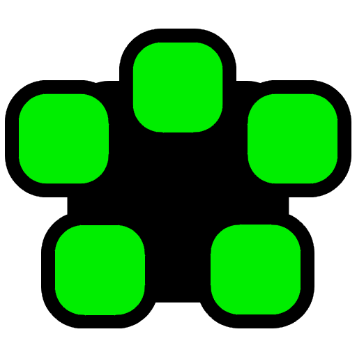

<p align="center">
  <a href="#" target="_blank">
    
  </a>
</p>

# Meeting System

This repository contains the source code for the "Meeting System," a full-stack application composed of a .NET backend and an Angular frontend. The project is designed with a clean separation of concerns and is fully containerized for ease of setup and deployment.

## Project Overview

The repository is structured into two primary components:

*   `./src/MeetingSystem/`: The backend system built with .NET 9, following Clean Architecture principles.
*   `./src/meeting-system-ui/`: The frontend application built with Angular 20+, using a modern, standalone component architecture.

For a comprehensive technical deep-dive into each component, including architecture, setup, and development workflows, please refer to their respective README files:

*   **[Backend README](./src/MeetingSystem/README.md)**
*   **[Frontend README](./src/meeting-system-ui/README.md)**

## Technology Stack

The project utilizes the following technologies:

| Category          | Technology                                       |
| ----------------- | ------------------------------------------------ |
| **Backend**       | .NET 9, ASP.NET Core, C#                         |
| **Frontend**      | Angular 20+, TypeScript, RxJS, SCSS              |
| **Database**      | Microsoft SQL Server                             |
| **ORM**           | Entity Framework Core 9                          |
| **Infrastructure**| Docker, MinIO (Object Storage), Hangfire (Jobs)  |
| **Authentication**| JWT (JSON Web Tokens)                            |
| **Backend Testing**| NUnit, Moq, FluentAssertions, Testcontainers     |
| **Frontend Testing**| Karma, Jasmine                                   |

## Architecture Highlights

### Backend (`MeetingSystem`)

The backend strictly adheres to the **Clean Architecture** pattern, creating a decoupled and maintainable system with a unidirectional dependency flow: `Api` → `Business` → `Context` → `Model`. This ensures that the core business logic is independent of UI, database, and external frameworks.

### Frontend (`meeting-system-ui`)

The frontend is built using Angular's latest **Standalone Components** architecture, which eliminates `NgModules` and promotes a more modular, tree-shakable, and simplified component design. State management is handled reactively using **RxJS** observable streams (`vm$`), providing a declarative and efficient way to manage component state.

## Quick Start

The entire application stack (backend, database, storage, etc.) is containerized and can be launched with a single command.

### Prerequisites

*   .NET 9 SDK
*   Docker Desktop
*   Node.js v18+
*   Yarn v4+ (enable with `corepack enable`)

### Running the Application

1.  **Start Backend Services:**
    Navigate to the `src/MeetingSystem` directory, configure your `.env` file from the provided template, and run Docker Compose.
    ```bash
    cd src/MeetingSystem
    # Create and configure your .env file from .env-template
    docker-compose up -d
    ```
    The backend API will be available at `http://localhost:8080`.

2.  **Start Frontend Application:**
    In a separate terminal, navigate to the `src/meeting-system-ui` directory, install dependencies, and start the development server.
    ```bash
    cd src/meeting-system-ui
    yarn install
    yarn start
    ```
    The frontend will be available at `http://localhost:4200`.
